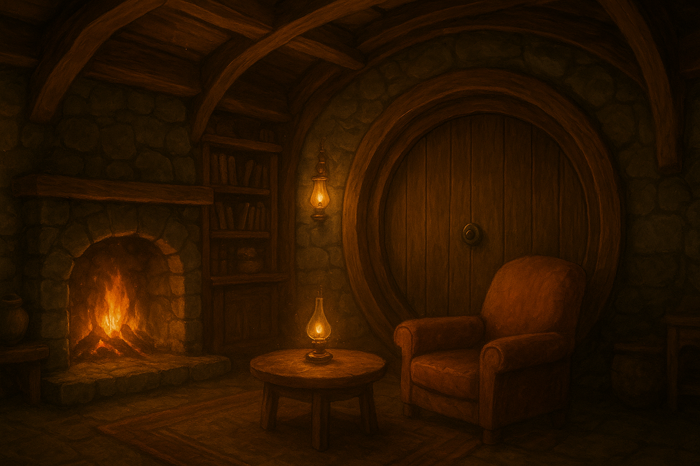

# 🧙‍♂️ Fantasy OS - Hobbit-Höhle Desktop Environment

> **VibeJam #2 Entry** | **Theme: Fantasy OS** | **Created by fr4iser**

Welcome to Fantasy OS, an immersive web-based desktop environment that transforms your browser into a magical hobbit-hole experience! Navigate through enchanted rooms, cast spells with gestures, and help your hobbit companion recover his lost credentials in this fantasy-themed operating system.



## ✨ Features

### 🏠 **Room-Based Navigation System**
- **Living Room** - Main desktop with fireplace and magical ambiance
- **Kitchen** - File manager disguised as a magical pantry
- **Bedroom** - Rest mode and memory recovery
- **Workshop** - Tools and applications crafting area
- **Library** - Document management with ancient tomes
- **Garden** - External connections and network portal

### 🎨 **Gesture Recognition Engine**
Draw magical gestures anywhere on screen to cast spells:
- **Circle** → Open portal (start applications)
- **Zigzag** → Lightning spell (turn on lights)
- **Spiral** → Fire magic (heat/energy)
- **Heart** → Add to favorites
- **Triangle** → Shield (protection/security)
- **Star** → Special magic functions

### 🗣️ **Natural Language Spell System**
Cast spells using natural language commands:
- `"ignite fireplace"` - Light the fireplace
- `"summon light"` - Turn on lamps
- `"open portal to kitchen"` - Navigate to kitchen
- `"store treasure in chest"` - Save files
- `"brew potion"` - Start downloads
- `"read ancient tome"` - Open documents

### 🧙‍♂️ **Dynamic Hobbit Companion**
- **Intelligent Dialogue System** - Context-aware responses
- **Personality Engine** - Multiple moods and emotional states
- **Memory System** - Remembers past interactions
- **Quest Guidance** - Helps you navigate the Fantasy OS

### 🎯 **Enhanced Quest System**
- **Multi-Act Storyline** - "The Hobbit's Lost Legacy" with 5 acts
- **Room-Specific Quests** - Unique questlines for each room
- **Achievement Tracking** - Unlock badges and rewards
- **Progress Persistence** - Save your adventure progress

### 🎵 **Immersive Audio Experience**
- **Ambient Sounds** - Hobbit-hole atmosphere
- **Action Feedback** - Magical sound effects
- **Spell Casting** - Audio cues for successful spells
- **Room-Specific Audio** - Unique sounds per environment

### 🎨 **Visual Effects**
- **Particle System** - Floating magical particles
- **Smooth Animations** - 60fps fantasy transitions
- **Responsive Design** - Works on desktop and mobile
- **Fantasy Color Palette** - Gold, purple, blue, and brown themes

## 🚀 Quick Start

### Prerequisites
- Modern web browser (Chrome, Firefox, Safari, Edge)
- JavaScript enabled
- LocalStorage support

### Installation
1. **Clone the repository:**
   ```bash
   git clone https://github.com/fr4iser/VibeJam-2.git
   cd VibeJam-2
   ```

2. **Install dependencies:**
   ```bash
   npm install
   ```

3. **Start the development server:**
   ```bash
   npm run dev
   # or
   npm start
   ```

4. **Open your browser:**
   Navigate to `http://localhost:3000`

### Alternative: Direct File Access
Simply open `index.html` in your browser for immediate access!

## 🎮 How to Play

### Basic Navigation
1. **Room Switching** - Click room tabs at the top to navigate
2. **Object Interaction** - Click on interactive objects (fireplace, lamp, chest)
3. **Spell Casting** - Type spells in the spell input or use gestures
4. **Quest System** - Click "Quests" button to view your adventure

### Gesture Controls
1. **Enable Gesture Mode** - Click anywhere on the screen
2. **Draw Gestures** - Use mouse or touch to draw magical patterns
3. **Watch Magic Happen** - Gestures trigger corresponding spells

### Hobbit Companion
1. **Talk to Hobbit** - Click the hobbit character or use dialogue buttons
2. **Quest Guidance** - Ask for help with current quests
3. **Progress Check** - Monitor your adventure progress

## 🛠️ Development Tools

### Object Editor
The project includes a powerful object editor (`object-editor.html`) for customizing:
- **Clickable Areas** - Define interactive zones on room images
- **Object Properties** - Set actions, tooltips, and behaviors
- **Visual Feedback** - Preview hover and click effects
- **Export/Import** - Save and load object configurations

### Testing Suite
Comprehensive testing with Playwright:
```bash
# Run all tests
npm test

# Run specific test suites
npm run test:unit
npm run test:integration
npm run test:e2e
```

## 📁 Project Structure

```
VibeJam-2/
├── 📄 index.html              # Main application entry point
├── 🎨 css/                    # Styling and themes
│   ├── fantasy-variables.css  # CSS custom properties
│   ├── main.css              # Core application styles
│   ├── quest-ui.css          # Quest system interface
│   └── hobbit-companion.css  # Hobbit companion styling
├── ⚡ js/                     # JavaScript modules
│   ├── main.js               # FantasyOS core application
│   ├── quest-manager.js      # Quest system controller
│   ├── hobbit-companion.js   # Hobbit AI companion
│   ├── gesture-recognition.js # Gesture detection engine
│   ├── spell-parser.js       # Natural language processing
│   └── utils/                # Helper utilities
├── 🎵 assets/                # Media resources
│   ├── images/               # Room backgrounds and objects
│   ├── sounds/               # Audio effects and ambient
│   └── fonts/                # Fantasy typography
├── 🧪 frontend/tests/        # Comprehensive test suite
├── 📚 docs/                  # Documentation and roadmap
└── 🛠️ object-editor.html     # Development tools
```

## 🎯 Quest System Details

### Main Questline: "The Hobbit's Lost Legacy"

#### Act 1: Credential Recovery
Help the hobbit recover his Fantasy OS credentials scattered across rooms.

#### Act 2: Ancient Artifacts Discovery
Discover and restore magical artifacts hidden throughout the hobbit-hole.

#### Act 3: Magic System Restoration
Repair the corrupted magic system and restore full functionality.

#### Act 4: Portal Network Activation
Activate the portal network connecting all rooms.

#### Act 5: Fantasy OS Mastery
Master the complete Fantasy OS and become a true wizard.

### Room-Specific Quests
- **Kitchen**: Culinary Magic - Master magical cooking
- **Library**: Knowledge Seeker - Restore ancient texts
- **Workshop**: Master Craftsman - Craft magical tools
- **Bedroom**: Dream Walker - Explore dream realms
- **Garden**: Nature's Guardian - Connect with nature

## 🏆 Achievements

Unlock achievements as you progress:
- **Quest Master** - Complete all main questline acts
- **Magic Master** - Master all magical abilities
- **Room Explorer** - Visit all rooms
- **Artifact Collector** - Collect all ancient artifacts
- **Hobbit Companion** - Become the hobbit's trusted friend

## 🔧 Technical Specifications

### Browser Support
- **Chrome**: 60+
- **Firefox**: 55+
- **Safari**: 12+
- **Edge**: 79+

### Performance
- **Load Time**: < 3 seconds
- **Animation**: 60 FPS
- **Memory Usage**: < 15MB
- **Responsive**: Mobile + Desktop

### Technologies Used
- **Frontend**: HTML5, CSS3, Vanilla JavaScript
- **Styling**: CSS Grid, Flexbox, Custom Properties
- **Audio**: Web Audio API
- **Storage**: LocalStorage for persistence
- **Testing**: Playwright for E2E testing

## 🎨 Customization

### Adding New Rooms
1. Create room background image
2. Add room tab in `index.html`
3. Define room-specific spells and interactions
4. Update quest content for new room

### Creating Custom Spells
```javascript
// Add to spell parser
const customSpells = {
    "my custom spell": {
        action: "customAction",
        room: "any",
        description: "Does something magical"
    }
};
```

### Modifying Hobbit Personality
Edit `js/hobbit-personality.js` to customize:
- Dialogue responses
- Mood changes
- Memory behavior
- Quest guidance

## 🐛 Troubleshooting

### Common Issues

**Gestures not working?**
- Ensure gesture recognition is enabled in settings
- Try refreshing the page
- Check browser compatibility

**Quests not saving?**
- Verify LocalStorage is enabled
- Clear browser cache and try again
- Check browser console for errors

**Audio not playing?**
- Check browser audio permissions
- Verify sound volume settings
- Try different audio formats

### Getting Help
1. Check the browser console for error messages
2. Review the documentation in `/docs`
3. Open an issue on GitHub
4. Contact the development team

## 🤝 Contributing

We welcome contributions! Here's how to get started:

1. **Fork the repository**
2. **Create a feature branch**: `git checkout -b feature/amazing-feature`
3. **Make your changes**
4. **Run tests**: `npm test`
5. **Commit changes**: `git commit -m 'Add amazing feature'`
6. **Push to branch**: `git push origin feature/amazing-feature`
7. **Open a Pull Request**

### Development Guidelines
- Follow existing code style
- Add tests for new features
- Update documentation
- Ensure cross-browser compatibility

## 📄 License

This project is licensed under the MIT License - see the [LICENSE](LICENSE) file for details.

## 🙏 Acknowledgments

- **VibeJam #2** - For the amazing Fantasy OS theme
- **Fantasy Community** - For inspiration and feedback
- **Open Source Libraries** - For the tools that made this possible
- **fr4iser** - Creator and maintainer

## 🌟 What a Great Time to Be Alive!

This Fantasy OS represents the magic of modern web development combined with the timeless appeal of fantasy adventures. Built with passion, creativity, and a touch of hobbit magic, it's a testament to what's possible when imagination meets technology.

---

**Created with ❤️ by fr4iser for VibeJam #2**

*"Not all those who wander are lost, but those who find Fantasy OS are truly found."* 🧙‍♂️✨
